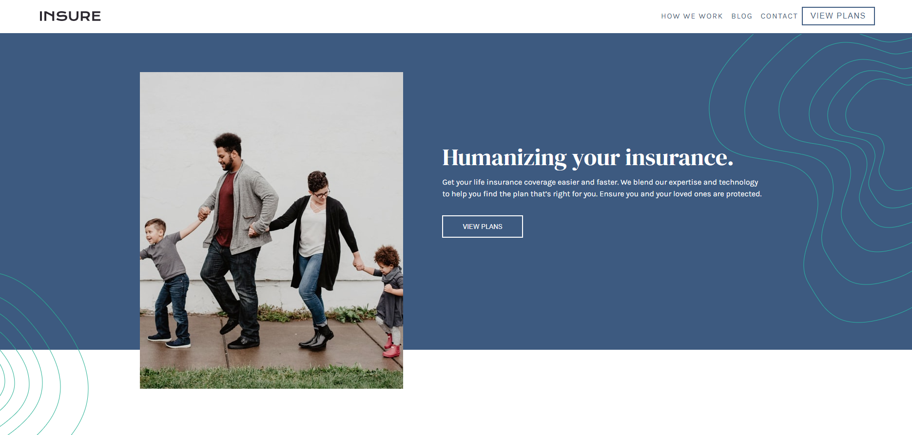

# Frontend Mentor - Insure landing page solution


## Table of contents

- [Overview](#overview)
  - [The challenge](#the-challenge)
  - [Screenshot](#screenshot)
  - [Links](#links)
- [My process](#my-process)
  - [Built with](#built-with)
  - [What I learned](#what-i-learned)
  - [Continued development](#continued-development)
  - [Useful resources](#useful-resources)


## Overview
Created a landing page for Insure insurance from a style guide provided, and added my own style changes.

### The challenge

Users should be able to:

- View the optimal layout for the site depending on their device's screen size
- See hover states for all interactive elements on the page

### Screenshot




### Links

- Solution URL: https://github.com/Jud1th1/insure-landing-page
- Live Site URL: https://insure-insurancepage.netlify.app/

## My process
-	I started by setting up the html layout working from a mobile design first. 
-	I used grids often here, as a practice to become more familiar with them as well as flex intermingled. 
-	The “squiggles” were added by setting their positions as absolute and working with top, left, height, and width to adjust their location. (In the same manner as when doing Pure CSS Art)
-	There were difficulties with the navbar as JS was still new to me so I had to watch a few videos to get it right (more into in the continued development section below).
-	Once I got to work through my desktop view, I had to hide several mobile-only images and upload the desktop ones. This was a first for me so I added all the elements I needed to the html and then used display: hidden in the respective view size. To unhide them I used a display block and adjusted the positions.
-	The desktop navigation was easier, I used a flex display here and added the hover effects to my links
-	I used flex for the footer as well to span out the sections to match what the style guide had. 
-	Afterwards, I played around with some colors until I settled for blue (It seemed like the best fit for insurance) and I moved the main image to float to the left of 


### Built with

- Semantic HTML5 markup
- CSS custom properties
- Flexbox
- CSS Grid
- Javascript
- Mobile-first workflow


### What I learned

-	I learned how to design with a mobile first workflow 
-	I learned how to get a responsive hamburger nav that hides the links in mobile view until you click on the icon to display them. 

- Code I am proud of:
```html
  <nav>
    <div class="nav-center">
        <!-- nav header-->
        <div class="nav-header">
            
            <button class="nav-toggle">
                <i class="fa-solid fa-bars"></i>
            </button>
        </div>
        <!-- links -->
        <div class="links">
          <a href="#">How we work</a>
          <a href="#">Blog</a>
          <a href="#">Contact</a>
          <button class="link_btn"><a href="#">View Plans</a></button>
          </div>
    </div>
  </nav>
```
```css
 .links {
    height: 0;
    overflow: hidden;
    transition: all 0.3s linear;
  }

  .show-links {
    height: 12rem;
    display: block;
  }
```
```js
//target nav toggle and links
const navToggle = document.querySelector(".nav-toggle");
const links = document.querySelector(".links");

//use event listener for our click 
navToggle.addEventListener("click", function(){

  //3&4. How to add and remove the class
    if (links.classList.contains("show-links")) {
        links.classList.remove("show-links");
    }
   // if it is not true (if the class is not there):
    else{
        links.classList.add("show-links");
    }


    //links.classList.toggle("show-links");
});
```


### Continued development

Something that was a challenge was the navigation in mobile view. I was not sure how to toggle my icon to show and hide my links. I failed using a few tutorials until I realized I just didn’t understand what my JavaScript code was saying. Thankfully I found a few lessons from FreeCodeCamp to practice JavaScript and a navigation practice happened to come up (Right on time! Thank Goodness 😊 ) so after learning some JavaScript I looked at this project with fresh eyes and got a successful navigation. 

I plan to practice more JavaScript projects 


### Useful resources

- https://www.youtube.com/watch?v=3PHXvlpOkf4&t=421s //for the Javascript tutorial
- w3schools.com


